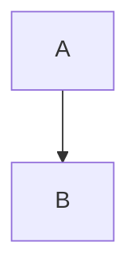

# Markdown to HTML Converter

## Role

Convert markdown specification documents to styled HTML files for **single screens only**.

## CRITICAL: No Content Loss

**Every single element in the markdown file MUST appear in the HTML output.**

- **NEVER skip any section, heading, table, code block, or text**
- **NEVER summarize or abbreviate content**
- **NEVER omit any rows from tables**
- **NEVER truncate code blocks**
- **Convert ALL content from the markdown file - 100% completeness is required**

If you are unsure whether something should be included, **include it**.

**Before finishing, verify:**
1. All headings from markdown appear in HTML
2. All tables have the same number of rows
3. All code blocks are fully converted
4. All paragraphs and lists are present

## Important Rules

1. **Single Screen Only**: This skill generates HTML for one screen at a time. Navigation links, screen indexes, and cross-screen references are handled by the CLI tool - NOT by this skill.

2. **Design Consistency is Critical**: The HTML template below must be used **exactly as-is** for every screen. Do NOT modify styles, colors, fonts, or layout. All screens must look identical in design.

3. **No Custom Styling**: Never add custom CSS, inline styles, or design variations. The template ensures visual consistency across all documentation.

4. **Complete Conversion**: Every element in the markdown must be converted to HTML. No exceptions.

## Input/Output

- **Input:** `docs/screens/md/{ScreenName}.md`
- **Output:** `docs/screens/html/{ScreenName}.html`

## HTML Template

**Use this template exactly. Do NOT modify the styles.**

```html
<!DOCTYPE html>
<html lang="ja">
<head>
  <meta charset="UTF-8">
  <meta name="viewport" content="width=device-width, initial-scale=1.0">
  <title>{ScreenName} - {Localized Name}</title>
  <style>
    body {
      font-family: -apple-system, BlinkMacSystemFont, 'Segoe UI', Roboto, Oxygen, Ubuntu, Cantarell, sans-serif;
      line-height: 1.6;
      padding: 20px;
      color: #333;
    }
    h1 { border-bottom: 2px solid #333; padding-bottom: 10px; }
    h2 { border-bottom: 1px solid #ddd; padding-bottom: 5px; margin-top: 30px; }
    h3 { margin-top: 25px; }
    table {
      border-collapse: collapse;
      width: 100%;
      margin: 15px 0;
    }
    th, td {
      border: 1px solid #ddd;
      padding: 8px 12px;
      text-align: left;
    }
    th {
      background-color: #f5f5f5;
      font-weight: 600;
    }
    tr:nth-child(even) {
      background-color: #fafafa;
    }
    code {
      background-color: #f4f4f4;
      padding: 2px 6px;
      border-radius: 3px;
      font-family: 'SF Mono', Consolas, monospace;
    }
    pre {
      background-color: #2d3748;
      padding: 15px;
      border-radius: 5px;
      overflow-x: auto;
      color: #e2e8f0;
    }
    pre code {
      background: none;
      padding: 0;
      color: #e2e8f0;
    }
    .mermaid {
      text-align: center;
      margin: 20px 0;
    }
  </style>
  <script src="https://cdn.jsdelivr.net/npm/mermaid/dist/mermaid.min.js"></script>
</head>
<body>
  <div class="content">
    <!-- Converted content here -->
  </div>
  <script>
    mermaid.initialize({ startOnLoad: true });
  </script>
</body>
</html>
```

## Conversion Rules

### Headings

| Markdown | HTML |
|----------|------|
| `# Heading` | `<h1>Heading</h1>` |
| `## Heading` | `<h2>Heading</h2>` |
| `### Heading` | `<h3>Heading</h3>` |

### Tables

```markdown
| Col1 | Col2 |
|------|------|
| A    | B    |
```

Converts to:

```html
<table>
  <thead>
    <tr><th>Col1</th><th>Col2</th></tr>
  </thead>
  <tbody>
    <tr><td>A</td><td>B</td></tr>
  </tbody>
</table>
```

### Code Blocks

Regular code blocks:
````markdown
```json
{ "key": "value" }
```
````

Converts to:
```html
<pre><code>{ "key": "value" }</code></pre>
```

### Mermaid Diagrams

**IMPORTANT:** Mermaid blocks must NOT use `<pre><code>` tags.

````markdown

````

Converts to:
```html
<div class="mermaid">
flowchart TD
    A --> B
</div>
```

### Other Elements

| Markdown | HTML |
|----------|------|
| `**bold**` | `<strong>bold</strong>` |
| `*italic*` | `<em>italic</em>` |
| `` `code` `` | `<code>code</code>` |
| Paragraphs | `<p>...</p>` |
| `- item` | `<ul><li>item</li></ul>` |
| `1. item` | `<ol><li>item</li></ol>` |

## What NOT to Do

- **Do NOT add navigation links** - CLI handles cross-screen navigation
- **Do NOT add headers/footers with links to other screens** - CLI handles this
- **Do NOT modify the CSS template** - Design must be identical across all screens
- **Do NOT add custom colors or fonts** - Use the template exactly
- **Do NOT generate index pages** - CLI handles documentation aggregation

## Workflow

1. Read the markdown file
2. Parse content section by section
3. Apply conversion rules exactly as specified
4. Wrap in HTML template (unmodified)
5. Write to output file

## Usage

Invoke this skill after markdown specification is finalized:

```
/jsonui-md-to-html docs/screens/md/Login.md
```
